# Notes of the PLL workshop

## PLL_D1SK1_L1 - Introduction to PLL

The objetive of a Phase-Locked Loop circuit is to get a precise clock signal with minimum frequency or phase noise.

We consider two classes of oscillators

    - Quartz Crystal _ Present superior spectral purity and phase noise performance

    - Voltage Controlled Oscillator - Good flexibility and can be implementable on a chip

Way of work:
The PLL mimics its reference signal to have the same frquency, or a multiple of it, with a constant phase difference with it.

A PLL is theoretically composed of a control system and an on-chip oscillator.

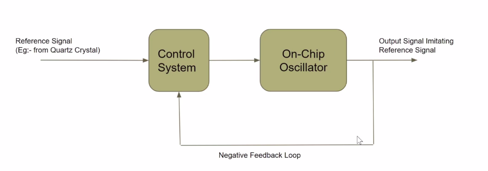

The pratical components of a PLL are represented on :

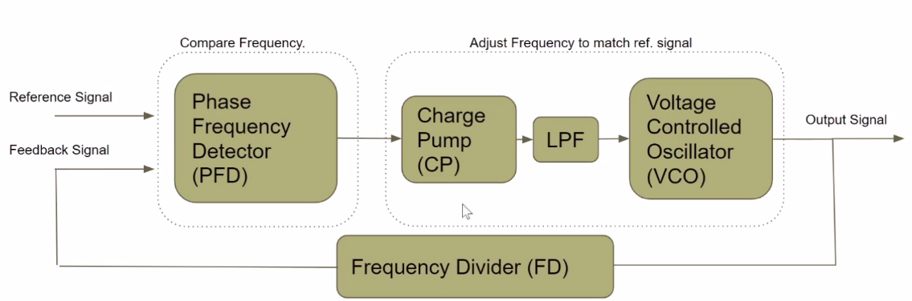

PLL components

- Phase Frequency Detector (PFD)
- Charge Pump (CP)
- Loop Filter (LF)
- Voltage Controlled Oscillator (VCO)
- Frequency divider (FD)

## PLL_D1SK1_L2 - Introduction to Phase Frequency Detector

The Phase Frequency Detector (PFD) role is to calculate the frequency and the phase relation of the output compared to the reference signal. A way to measure the similarity between two signals is to perform an exclusive xor (XOR) operation, as shown in *Insert picture *.

The XOR operation, although good to compare the signals similarity, is not able to provide the information on the phase difference between them, if the output is ahead or delayed in time.

Aiming to provide an operation that is able to distinguish between a leading or lagging output signal, as in *ref pll_leading_lagging.png*, and different frequencies, as in *ref pll_pfd_down_up*, a digital circuit is sought.

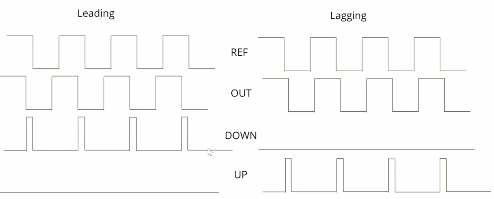

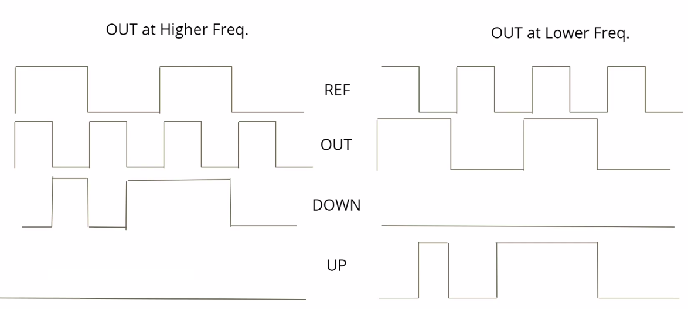

The state machine to guide the operation of such circuit is, then, defined in *ref pll_pfd_fsm.png*. The proposed digital circuit, based on two D flip-flops, that meet this requirements is presented in *ref pll_pfd_fsm.png*.

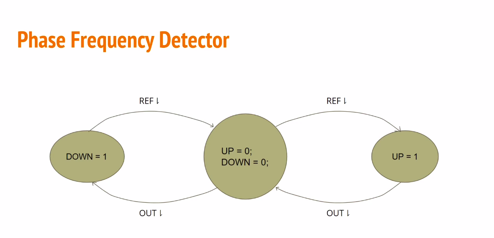

Considering that this digital circuit as an ideal model, it presents limitations when implemented physically. One limitation is how small a difference in phase or frequency it is able to detect, where anything beyond it is called the Dead Zone. The effect of the Dead Zone is seen on the passes from *ref pll_pfd_in_dead_zone.png* to *ref pll_pfd_not_in_dead_zone.png*

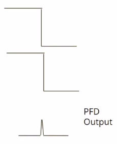
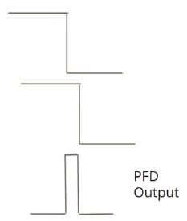

## PLL_D1SK1_L3 - Introduction to Charge Pump

The Charge Pump (CP) role is to convert a discrete measure of phase and frequencymeasure into an analog control signal, with the purpose to control the oscillator step.

A theoretical model for the CP is show in *insert pll_cp_model.png*.

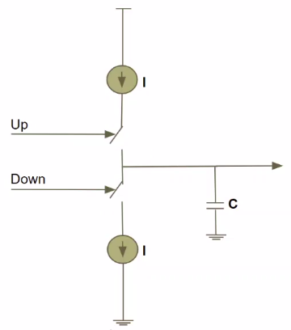

Its functioning can be analyzed in two steps. The first, shown in *pll_cp_charge.png* when the Up signal is high, it charges the capacitor C creating a voltage on it. The second, shown in *pll_cp_drain.png* when the signal Down is high, it drains the charge from C decreasing the voltage over it.

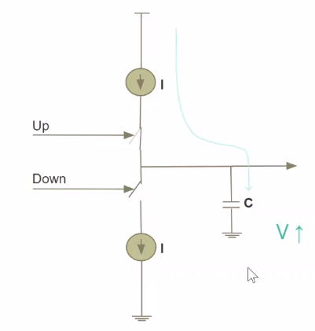

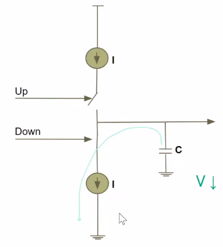

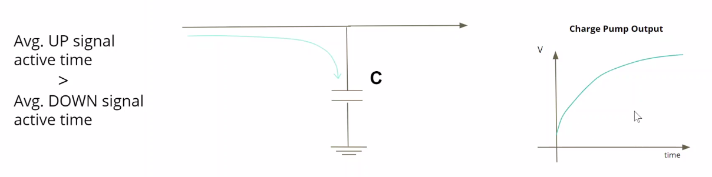
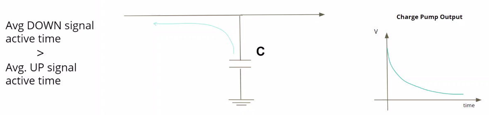

Even though the output is proportional to an average of the time the Up or the Down signals are activated, the output can still show high frequency components due to the switching. To tackle this, a circuit called Loop Filter (LF), shown in *insert pll_cp_lf.png* is added to the output.

As a rule of thumb, the relation between Cx and C is defined by Cx ~= C/10, to maintain the stabilization of the loop.

The bandwidth of the loopfilter is ruled by the highest output frequency divided by 10. To calculate it, the Loop Filter BW = 1/(1+R.C1), where C1 = C.Cx/(C+Cx).

## PLL_D2SK1_L9 PLL components circuit design

This practice consists on the composition of the SPICE simulation file for a frequency divider circuit on *FD.jpg* , as seen on the file FreqDiv.cir.

On this circuit, in summary, terminal 1 is the Vdd of 1.8 V, 0 the ground, 2 is the input feed by a clock source with 10 ns period and 6 is the output. The simulation plot in *imgs/sim_FreqDiv.svg* shows that the frequency of the output is the inout frequency divided by 2.

## PLL_D2SK1_L11 - Steps to combine PLL sub-circuits and PLL full design simulation

The complete SPICE file for the circuit of the Pre-Layout is shown on *PLL_PreLay.cir*.

